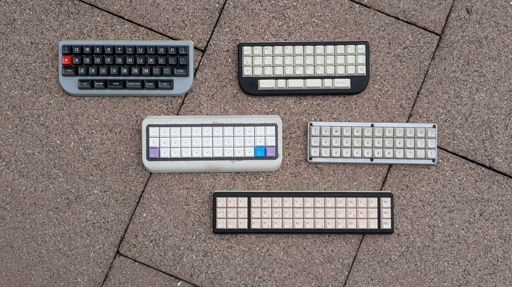

# The three musketeers
A low(-ish) profile 3- or 4-row mechanical keyboard with a speaker supporting ortho and alpha stagger layouts, optional numpad, and optional 3 function keys.

## About

The three musketeers is a mechanical keyboard powered by RP2040 Zero development board. It is designed with optional clusters in mind, which you can either use or break away. Here are some particulars:

- Designed to support either KS-33B or Gateron low profile V3 switches. The PCB will accept the MX style switches too, but there is no case for these so far.
- Features KLJ-1102 speaker. I use it for announcing mod activation on keyboards with home row modifiers. You may use it for anything else per your liking, or not use it at all.
- I designed a couple of cases for this PCB, see below. All of them are low profile aimed on Gateron switches exclusively.
