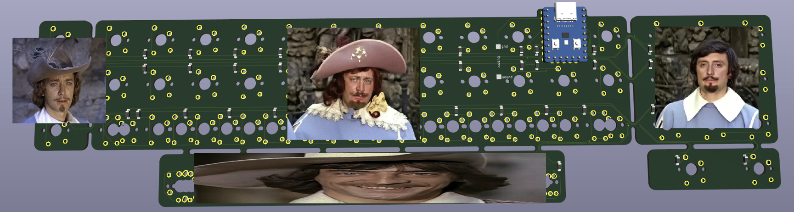
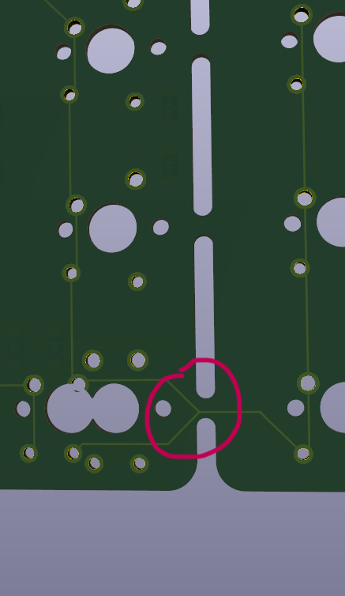
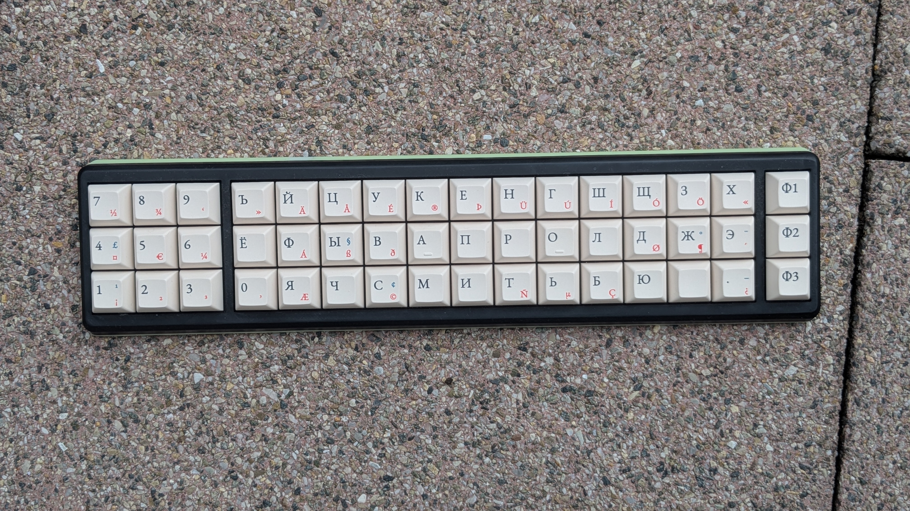
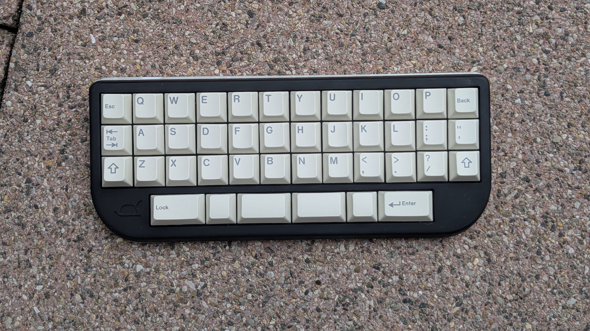
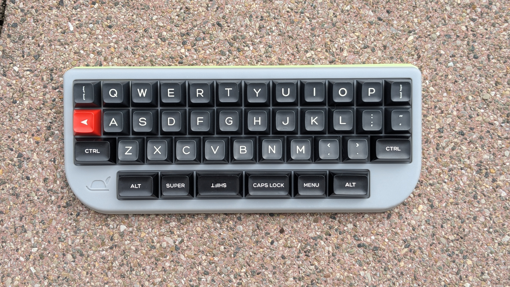
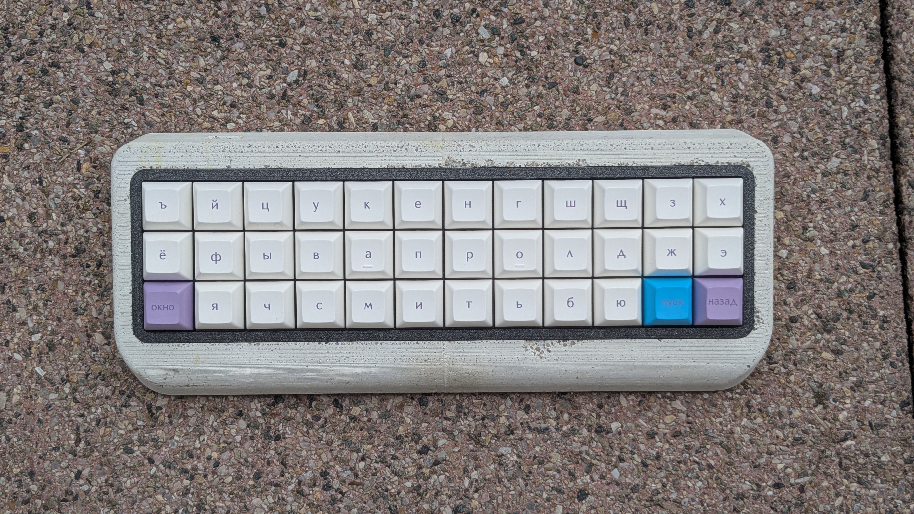
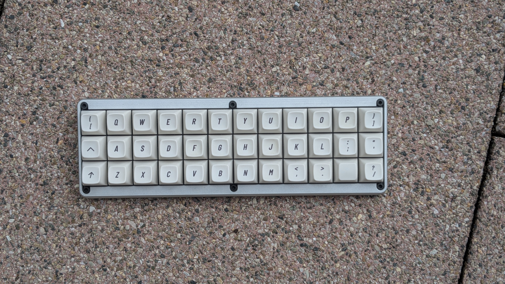

# The three musketeers
A low(-ish) profile 3- or 4-row mechanical keyboard with a speaker supporting ortho and alpha stagger layouts, optional numpad, and optional 3 function keys.

## About

The three musketeers is a mechanical keyboard powered by RP2040 Zero development board. It is designed with optional clusters in mind, which you can either use or break away. Here are some particulars:

- Designed to support either KS-33B or Gateron low profile V3 switches. The PCB will accept the MX style switches too, but there is no case for these so far.
- I designed a couple of cases for this PCB, see below. All of them are low profile aimed on Gateron switches exclusively.
- Features KLJ-1102 speaker. I use it for announcing mod activation on keyboards with home row modifiers. You may use it for anything else per your liking, or not use it at all.

## How to build one

> [!IMPORTANT]
> If you will be chopping the function column off the PCB, make sure this trace remains intact. Otherwise you will have to bridge it.
> 

#### Part list
| #     | name                 | comments                                  |
|-------|----------------------|-------------------------------------------|
| 1     | Main PCB             | Order at fabricator of your choice        |
| 1     | Case                 | See below                                 |
| 1     | RP2040 Zero          |                                           |
| 36-56 | Switches             | Gateron low profile KS-33b or v3          |
| 36-56 | Keycaps              | MX-compatible                             |
| 4     | Rubber bump-ons      | 10mm                                      |
| 16    | Magnets              | Cylinder 1x5mm                            |
| 1     | Optional Speaker     | KLJ-1102 (https://keeb.supply/products/piezo-buzzer)  |

### 3D-printed cases

All these cases are printed in SLA by JLC. They turned out for me half-decent, and you may face warpage of longer parts. The assembly is straight-forward:

- Solder the sockets to the PCB and the pins to the controller.
- Solder the speaker of you have it.
- Mount the corner switches to the upper case part and solder them to the PCB. The PCB should seat flush to the integrated case.
- Mount and solder all other switches.
- Mount the controller onto the PCB.

Done!

### Concrete case

A successful attempt of a concrete case was made! I used MOBY DUR furniture concrete mixture, which turned out sturdy and was easy to demould, but required sanding (https://www.moertelshop.com/buy-white-grout-for-concrete-furniture-cheaply-5.html). You may or may not get better results with liquid floor mixtures.

The assembly consists of a concrete case and plate insert. The plate is soldered together with the PCB as with the 3D-printed cases, and then inserted into the case. It should be held inside firmly with friction.

- Print out the negative mould in PLA.
- Pour the concrete into the mold, make sure it sets level.
- When it sets, carefully demould with hot air gun. Try aiming at the mould rather than at the concrete directly.
- Repair any damage you made along the way.
- If you find this appealing, you same sand the case. Make sure not to sand the internal cavities!

### Aluminium case (handwire)

This version does not use the PCB at all, and thus is not directly connected to the The three musketeers project. However it was designed in the same wave of inspiration as everything else, so I figured it belongs here too. 

> [!NOTE]
> I used Kailh Element switches for this project. If you want to use different ones, check their plate footprint and adjust accordingly.

#### Part list
| #     | name                 | comments                                  |
|-------|----------------------|-------------------------------------------|
| 1     | Main case            | Order at fabricator of your choice        |
| 1     | Plate                | I printed out in PETG                     |
| 1     | MCU insert           | I printed out in PETG. Avoid brittle materials.                    |
| 1     | RP2040 Zero          |                                           |
| 36-56 | Switches             | Kailh Element                             |
| 36-56 | Keycaps              | MX-compatible                             |
| 4     | Rubber bump-ons      | 10mm                                      |
| 6     | M3 hex socket screws | 5 or 6 mm will do                               |
| 1     | Optional Speaker     | KLJ-1102 (https://keeb.supply/products/piezo-buzzer)  |

- Solder the switches to the plate with diodes like usual.
- Hook up the matrix to applicable pins on the controller.
- Clip in the controller into the controller insert.
- Clip the insert into the aluminim case.
- Screw the plate to the case while carefully laying out the wires. 

## Firmware

I don't provide firmware to this keyboard for now. For those wishing to compile their own, see the rows and columns references in the pcb schematic.